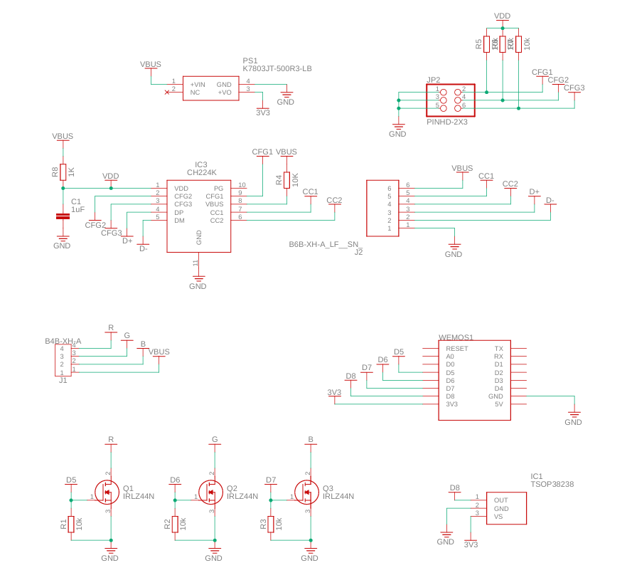

# Heart Lamp

This repository contains all the necessary files and instructions to build a heart-shaped lamp that can be controlled via WiFi and IR receiver. The lamp is based on the WEMOS D1 Mini board with WLED firmware and features a unique heart-shaped design.

# Table of contents
- [Heart Lamp](#heart-lamp)
- [Table of contents](#table-of-contents)
- [Features](#features)
- [Assembly Instructions](#assembly-instructions)
  - [Electronics](#electronics)
    - [BOM](#bom)
    - [Schematics](#schematics)

# Features
- WiFi Control: Easily control the lamp via WiFi using the WLED mobile app or web interface.
- IR Receiver: Allows control of the lamp using an infrared remote control.
- Customizable: The lamp design can be customized to fit your preferences.
- Easy Assembly: Simple assembly process with detailed instructions.

# Assembly Instructions

## Electronics

### BOM
| Part   | Value            | Device                   | Description                                                                                                         |
|--------|------------------|--------------------------|---------------------------------------------------------------------------------------------------------------------|
| C1     | 1uF              | C_CHIP-0603(1608-METRIC) | Capacitor - Generic                                                                                                 |
| IC1    | TSOP38238        | TSOP38238                | IR Remote Receiver 38KHz 45m                                                                                        |
| IC3    | CH224K           | CH224K                   | ESSOP-10 USB ICs ROHS                                                                                               |
| J1     | B4B-XH-A         | B4B-XH-A                 | XH Connector Top Entry - 4POS                                                                                       |
| J2     | B6B-XH-A_LF__SN_ | B6B-XH-A_LF__SN_         | CONN HEADER VERT 6POS 2.5MM                                                                                         |
| JP2    | PINHD-2X3        | PINHD-2X3                | PIN HEADER                                                                                                          |
| PS1    | K7803JT-500R3-LB | K7803JT-500R3-LB         | LINEAR REGULATOR REPLACEMENT DC Non-Isolated PoL Module DC DC Converter 1 Output 3.3V - - - 500mA 4.75V - 36V Input |
| Q1     | IRLZ44N          | IRLZ44N                  | MOSFET MOSFET, 55V, 41A, 22 mOhm, 32 nC Qg, Logic Level, TO-220AB                                                   |
| Q2     | IRLZ44N          | IRLZ44N                  | MOSFET MOSFET, 55V, 41A, 22 mOhm, 32 nC Qg, Logic Level, TO-220AB                                                   |
| Q3     | IRLZ44N          | IRLZ44N                  | MOSFET MOSFET, 55V, 41A, 22 mOhm, 32 nC Qg, Logic Level, TO-220AB                                                   |
| R1     | 10k              | R_AXIAL-7.2MM-PITCH      | Resistor Fixed - Generic                                                                                            |
| R2     | 10k              | R_AXIAL-7.2MM-PITCH      | Resistor Fixed - Generic                                                                                            |
| R3     | 10k              | R_AXIAL-7.2MM-PITCH      | Resistor Fixed - Generic                                                                                            |
| R4     | 10K              | R_CHIP-0603(1608-METRIC) | Resistor Fixed - Generic                                                                                            |
| R5     | 10k              | R_CHIP-0603(1608-METRIC) | Resistor Fixed - Generic                                                                                            |
| R6     | 10k              | R_CHIP-0603(1608-METRIC) | Resistor Fixed - Generic                                                                                            |
| R7     | 10k              | R_CHIP-0603(1608-METRIC) | Resistor Fixed - Generic                                                                                            |
| R8     | 1K               | R_CHIP-0603(1608-METRIC) | Resistor Fixed - Generic                                                                                            |
| WEMOS1 |                  | WEMOS-D1-MINI            | WeMos.cc                                                                                                            |
### Schematics

