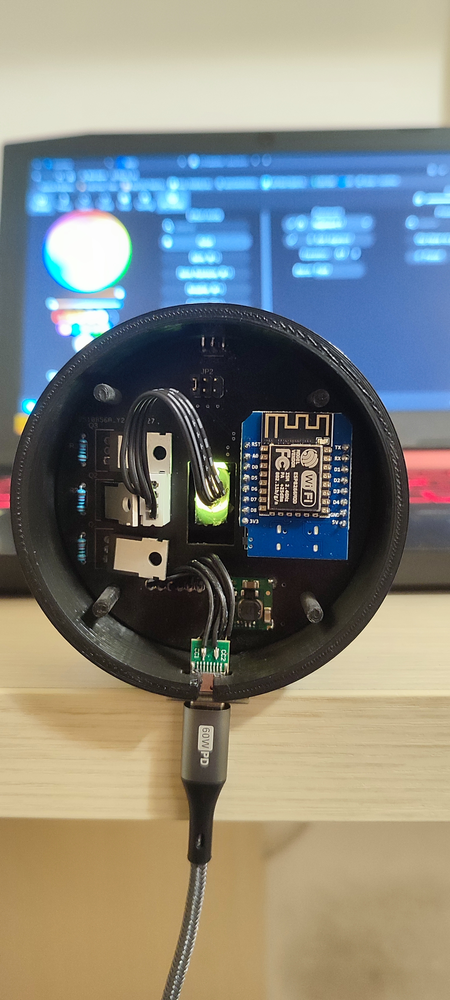
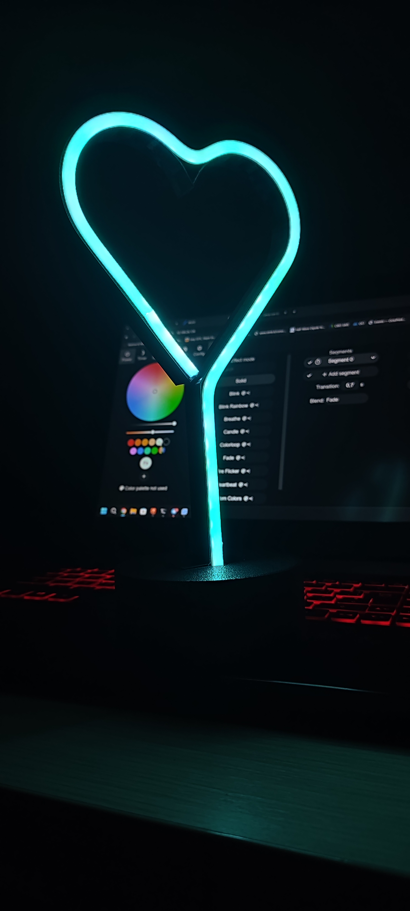
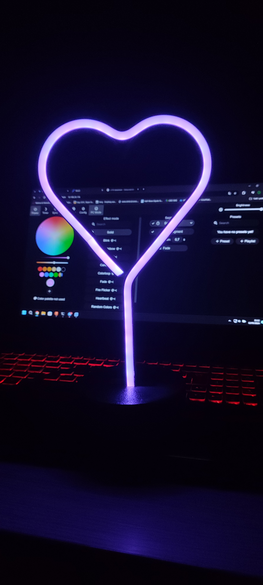

# Heart Lamp

This repository contains all the necessary files and instructions to build a heart-shaped lamp that can be controlled via WiFi and IR receiver. The lamp is based on the WEMOS D1 Mini board with WLED firmware and features a unique heart-shaped design.

# Table of contents
- [Heart Lamp](#heart-lamp)
- [Table of contents](#table-of-contents)
- [Features](#features)
- [Assembly Instructions](#assembly-instructions)
  - [3D Printing](#3d-printing)
  - [Electronics](#electronics)
    - [BOM](#bom)
    - [Schematics](#schematics)
    - [ESP Firmware](#esp-firmware)
  - [Final assembly](#final-assembly)
- [Photos](#photos)
- [Future updates](#future-updates)

# Features
- WiFi Control: Easily control the lamp via WiFi using the WLED mobile app or web interface.
- IR Receiver: Allows control of the lamp using an infrared remote control.
- Customizable: The lamp design can be customized to fit your preferences.
- Easy Assembly: Simple assembly process with detailed instructions.
- Powered via USB-C
- Supports 5V, 9V, 12V, 15V, 20V led strips
- Thanks to USB-C's PD protocol, you can select the right voltage for your LED strips(JP2). Be carefull selecting the right voltage or you might destroy the leds!

# Assembly Instructions

## 3D Printing

Print all 3 files, be careful: the stem may be too long for the printing plane, you may need to position it at 45° or print it at a slight angle. For the base, you may need to use the supports.

## Electronics

### BOM
| Part | Value | Device | Description | Link |
|---|---|---|---|---|
| C1 | 1uF | C_CHIP-0603(1608-METRIC) | Capacitor - Generic | [Link](https://it.aliexpress.com/item/1005006157020955.html?spm=a2g0o.order_list.order_list_main.58.29ec3696co5eem&gatewayAdapt=glo2ita) |
| IC1 | TSOP38238 | TSOP38238 | IR Remote Receiver 38KHz 45m | [Link](https://it.aliexpress.com/item/1005005343344128.html?spm=a2g0o.order_list.order_list_main.16.29ec3696co5eem&gatewayAdapt=glo2ita) |
| IC3 | CH224K | CH224K | ESSOP-10 USB ICs ROHS | [Link](https://it.aliexpress.com/item/1005006017022405.html?spm=a2g0o.order_list.order_list_main.64.29ec3696co5eem&gatewayAdapt=glo2ita) |
| J1 | B4B-XH-A | B4B-XH-A | XH Connector Top Entry - 4POS | [Link](https://it.aliexpress.com/item/1005005183951296.html?spm=a2g0o.order_list.order_list_main.71.29ec3696co5eem&gatewayAdapt=glo2ita) |
| J2 | B6B-XH-A_LF__SN_ | B6B-XH-A_LF__SN_ | CONN HEADER VERT 6POS 2.5MM | [Link](https://it.aliexpress.com/item/33005202279.html?spm=a2g0o.productlist.main.9.68461c5eOOSIHe&algo_pvid=d127428c-c5f1-4f64-ae13-1bb86bc3e236&algo_exp_id=d127428c-c5f1-4f64-ae13-1bb86bc3e236-4&pdp_npi=4%40dis%21EUR%215.18%215.18%21%21%215.45%215.45%21%402136637717155419130186981e2613%2167037233951%21sea%21IT%211840247043%21&curPageLogUid=ZQb7TMo1j2wu&utparam-url=scene%3Asearch%7Cquery_from%3A) |
| JP2 | PINHD-2X3 | PINHD-2X3 | PIN HEADER | [Link](https://it.aliexpress.com/item/1005006112365881.html?spm=a2g0o.productlist.main.23.781f7cc68VGld4&algo_pvid=da5f8c36-8c3b-4daa-a555-962f798cf215&aem_p4p_detail=202405121225412562974826204100003697313&algo_exp_id=da5f8c36-8c3b-4daa-a555-962f798cf215-11&pdp_npi=4%40dis%21EUR%212.14%211.88%21%21%2116.29%2114.34%21%402136637717155419407897328e2613%2112000035803506433%21sea%21IT%211840247043%21&curPageLogUid=DRvLvtMs8sue&utparam-url=scene%3Asearch%7Cquery_from%3A&search_p4p_id=202405121225412562974826204100003697313_4) |
| PS1 | K7803JT-500R3-LB | K7803JT-500R3-LB | LINEAR REGULATOR REPLACEMENT DC Non-Isolated PoL Module DC DC Converter 1 Output 3.3V - - - 500mA 4.75V - 36V Input | [Link](https://it.aliexpress.com/item/1005004632042233.html?spm=a2g0o.order_list.order_list_main.46.29ec3696co5eem&gatewayAdapt=glo2ita) |
| Q1 | IRLZ44N | IRLZ44N | MOSFET MOSFET, 55V, 41A, 22 mOhm, 32 nC Qg, Logic Level, TO-220AB | [Link](https://it.aliexpress.com/item/1005004533156263.html?spm=a2g0o.home.0.0.120d6a54jGe5tI&mp=1&gatewayAdapt=glo2ita) |
| Q2 | IRLZ44N | IRLZ44N | MOSFET MOSFET, 55V, 41A, 22 mOhm, 32 nC Qg, Logic Level, TO-220AB | [Link](https://it.aliexpress.com/item/1005004533156263.html?spm=a2g0o.home.0.0.120d6a54jGe5tI&mp=1&gatewayAdapt=glo2ita) |
| Q3 | IRLZ44N | IRLZ44N | MOSFET MOSFET, 55V, 41A, 22 mOhm, 32 nC Qg, Logic Level, TO-220AB | [Link](https://it.aliexpress.com/item/1005004533156263.html?spm=a2g0o.home.0.0.120d6a54jGe5tI&mp=1&gatewayAdapt=glo2ita) |
| R1 | 10k | R_AXIAL-7.2MM-PITCH | Resistor Fixed - Generic | [Link](https://it.aliexpress.com/item/1005006706426367.html?spm=a2g0o.order_list.order_list_main.70.29ec3696co5eem&gatewayAdapt=glo2ita) |
| R2 | 10k | R_AXIAL-7.2MM-PITCH | Resistor Fixed - Generic | [Link](https://it.aliexpress.com/item/1005006706426367.html?spm=a2g0o.order_list.order_list_main.70.29ec3696co5eem&gatewayAdapt=glo2ita) |
| R3 | 10k | R_AXIAL-7.2MM-PITCH | Resistor Fixed - Generic | [Link](https://it.aliexpress.com/item/1005006706426367.html?spm=a2g0o.order_list.order_list_main.70.29ec3696co5eem&gatewayAdapt=glo2ita) |
| R4 | 10K | R_CHIP-0603(1608-METRIC) | Resistor Fixed - Generic | [Link](https://it.aliexpress.com/item/1005006157071739.html?spm=a2g0o.order_list.order_list_main.59.29ec3696co5eem&gatewayAdapt=glo2ita) |
| R5 | 10k | R_CHIP-0603(1608-METRIC) | Resistor Fixed - Generic | [Link](https://it.aliexpress.com/item/1005006157071739.html?spm=a2g0o.order_list.order_list_main.59.29ec3696co5eem&gatewayAdapt=glo2ita) |
| R6 | 10k | R_CHIP-0603(1608-METRIC) | Resistor Fixed - Generic | [Link](https://it.aliexpress.com/item/1005006157071739.html?spm=a2g0o.order_list.order_list_main.59.29ec3696co5eem&gatewayAdapt=glo2ita) |
| R7 | 10k | R_CHIP-0603(1608-METRIC) | Resistor Fixed - Generic | [Link](https://it.aliexpress.com/item/1005006157071739.html?spm=a2g0o.order_list.order_list_main.59.29ec3696co5eem&gatewayAdapt=glo2ita) |
| R8 | 1K | R_CHIP-0603(1608-METRIC) | Resistor Fixed - Generic | [Link](https://it.aliexpress.com/item/1005006157071739.html?spm=a2g0o.order_list.order_list_main.59.29ec3696co5eem&gatewayAdapt=glo2ita) |
| WEMOS1 |  | WEMOS-D1-MINI | WeMos.cc | [Link](https://it.aliexpress.com/item/1005006365878568.html?spm=a2g0o.order_list.order_list_main.29.29ec3696co5eem&gatewayAdapt=glo2ita) |
| USB-C |  | USB-C 6 pin connector |  | [Link](https://it.aliexpress.com/item/1005005996991234.html?spm=a2g0o.order_list.order_list_main.52.29ec3696co5eem&gatewayAdapt=glo2ita) |
| LED strip |  | LED strip |  | [Link](https://it.aliexpress.com/item/1005005467162038.html?spm=a2g0o.order_list.order_list_main.28.29ec3696co5eem&gatewayAdapt=glo2ita) |

### Schematics

### ESP Firmware

Follow the WLED [official guide](https://kno.wled.ge/basics/install-binary/) to install the firmware. I recommend to use the [installer site](https://install.wled.me/).

Once installed enter the WLED interface, select settings -> LED Preferences:
- On Hardware setup select `PWM RGB` and set the GPIOs to **12**, **13**, **14**
- Scroll down slightly to `IR GPIO` and set the value to **15** and **24-Key RGB**
- Click save

## Final assembly

Once you have printed all the files and soldered the various components to the PCB proceed by following the steps: 

- Gluing the LED strip inside the stem channel. Remember to cut the LED strip where indicated, the total length should be approximately 50cm
- Desolder the old connector from the LEDs and solder 4 new wires. Keep in mind what is the cable that carries the power(called 5v on the led strip)
- Crimp the XH2.54 female connector to the 4 wires keeping in mind that the top pin(the one closest to the IR sensor) should be the power supply for the LEDs. The other cables can also be crimped in another sequence, it will be possible to remap them later on the WEB interface
- (Optional) To increase the mechanical strength of the led strip near the soldering coat with hot glue
- Stick the stem inside the base, the stem should go in with a little force
- Insert the PCB inside the base and connect the LEDs
- Try turning on the lamp on by powering it through the usb-c connector and check that everything is ok
- Close the lamp by snapping the cover on. congratulations. your lamp is now working

# Photos

| | |
| - | - |
|  |  |
|  |  |

# Future updates
- Use SMD mosfets
- Create other shapes