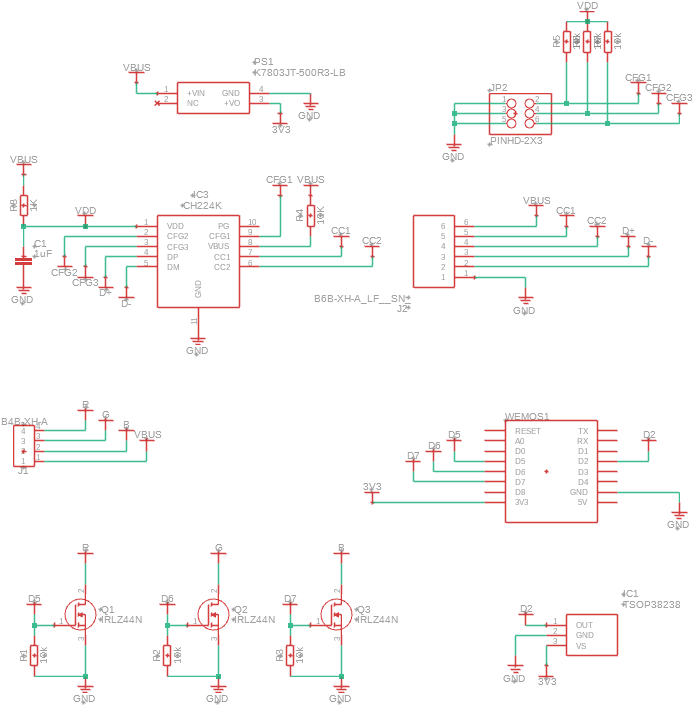

# Heart Lamp

This repository contains all the necessary files and instructions to build a heart-shaped lamp that can be controlled via WiFi and IR receiver. The lamp is based on the WEMOS D1 Mini board with WLED firmware and features a unique heart-shaped design.

# Table of contents
- [Heart Lamp](#heart-lamp)
- [Table of contents](#table-of-contents)
- [Features](#features)
- [Assembly Instructions](#assembly-instructions)
  - [Electronics](#electronics)
    - [BOM](#bom)
    - [Schematics](#schematics)

# Features
- WiFi Control: Easily control the lamp via WiFi using the WLED mobile app or web interface.
- IR Receiver: Allows control of the lamp using an infrared remote control.
- Customizable: The lamp design can be customized to fit your preferences.
- Easy Assembly: Simple assembly process with detailed instructions.

# Assembly Instructions

## Electronics

### BOM
| Part | Value | Device | Description | Link |
|---|---|---|---|---|
| C1 | 1uF | C_CHIP-0603(1608-METRIC) | Capacitor - Generic | [Link](https://it.aliexpress.com/item/1005006157020955.html?spm=a2g0o.order_list.order_list_main.58.29ec3696co5eem&gatewayAdapt=glo2ita) |
| IC1 | TSOP38238 | TSOP38238 | IR Remote Receiver 38KHz 45m | [Link](https://it.aliexpress.com/item/1005005343344128.html?spm=a2g0o.order_list.order_list_main.16.29ec3696co5eem&gatewayAdapt=glo2ita) |
| IC3 | CH224K | CH224K | ESSOP-10 USB ICs ROHS | [Link](https://it.aliexpress.com/item/1005006017022405.html?spm=a2g0o.order_list.order_list_main.64.29ec3696co5eem&gatewayAdapt=glo2ita) |
| J1 | B4B-XH-A | B4B-XH-A | XH Connector Top Entry - 4POS | [Link](https://it.aliexpress.com/item/1005005183951296.html?spm=a2g0o.order_list.order_list_main.71.29ec3696co5eem&gatewayAdapt=glo2ita) |
| J2 | B6B-XH-A_LF__SN_ | B6B-XH-A_LF__SN_ | CONN HEADER VERT 6POS 2.5MM | [Link](https://it.aliexpress.com/item/33005202279.html?spm=a2g0o.productlist.main.9.68461c5eOOSIHe&algo_pvid=d127428c-c5f1-4f64-ae13-1bb86bc3e236&algo_exp_id=d127428c-c5f1-4f64-ae13-1bb86bc3e236-4&pdp_npi=4%40dis%21EUR%215.18%215.18%21%21%215.45%215.45%21%402136637717155419130186981e2613%2167037233951%21sea%21IT%211840247043%21&curPageLogUid=ZQb7TMo1j2wu&utparam-url=scene%3Asearch%7Cquery_from%3A) |
| JP2 | PINHD-2X3 | PINHD-2X3 | PIN HEADER | [Link](https://it.aliexpress.com/item/1005006112365881.html?spm=a2g0o.productlist.main.23.781f7cc68VGld4&algo_pvid=da5f8c36-8c3b-4daa-a555-962f798cf215&aem_p4p_detail=202405121225412562974826204100003697313&algo_exp_id=da5f8c36-8c3b-4daa-a555-962f798cf215-11&pdp_npi=4%40dis%21EUR%212.14%211.88%21%21%2116.29%2114.34%21%402136637717155419407897328e2613%2112000035803506433%21sea%21IT%211840247043%21&curPageLogUid=DRvLvtMs8sue&utparam-url=scene%3Asearch%7Cquery_from%3A&search_p4p_id=202405121225412562974826204100003697313_4) |
| PS1 | K7803JT-500R3-LB | K7803JT-500R3-LB | LINEAR REGULATOR REPLACEMENT DC Non-Isolated PoL Module DC DC Converter 1 Output 3.3V - - - 500mA 4.75V - 36V Input | [Link](https://it.aliexpress.com/item/1005004632042233.html?spm=a2g0o.order_list.order_list_main.46.29ec3696co5eem&gatewayAdapt=glo2ita) |
| Q1 | IRLZ44N | IRLZ44N | MOSFET MOSFET, 55V, 41A, 22 mOhm, 32 nC Qg, Logic Level, TO-220AB | [Link](https://it.aliexpress.com/item/1005004533156263.html?spm=a2g0o.home.0.0.120d6a54jGe5tI&mp=1&gatewayAdapt=glo2ita) |
| Q2 | IRLZ44N | IRLZ44N | MOSFET MOSFET, 55V, 41A, 22 mOhm, 32 nC Qg, Logic Level, TO-220AB | [Link](https://it.aliexpress.com/item/1005004533156263.html?spm=a2g0o.home.0.0.120d6a54jGe5tI&mp=1&gatewayAdapt=glo2ita) |
| Q3 | IRLZ44N | IRLZ44N | MOSFET MOSFET, 55V, 41A, 22 mOhm, 32 nC Qg, Logic Level, TO-220AB | [Link](https://it.aliexpress.com/item/1005004533156263.html?spm=a2g0o.home.0.0.120d6a54jGe5tI&mp=1&gatewayAdapt=glo2ita) |
| R1 | 10k | R_AXIAL-7.2MM-PITCH | Resistor Fixed - Generic | [Link](https://it.aliexpress.com/item/1005006706426367.html?spm=a2g0o.order_list.order_list_main.70.29ec3696co5eem&gatewayAdapt=glo2ita) |
| R2 | 10k | R_AXIAL-7.2MM-PITCH | Resistor Fixed - Generic | [Link](https://it.aliexpress.com/item/1005006706426367.html?spm=a2g0o.order_list.order_list_main.70.29ec3696co5eem&gatewayAdapt=glo2ita) |
| R3 | 10k | R_AXIAL-7.2MM-PITCH | Resistor Fixed - Generic | [Link](https://it.aliexpress.com/item/1005006706426367.html?spm=a2g0o.order_list.order_list_main.70.29ec3696co5eem&gatewayAdapt=glo2ita) |
| R4 | 10K | R_CHIP-0603(1608-METRIC) | Resistor Fixed - Generic | [Link](https://it.aliexpress.com/item/1005006157071739.html?spm=a2g0o.order_list.order_list_main.59.29ec3696co5eem&gatewayAdapt=glo2ita) |
| R5 | 10k | R_CHIP-0603(1608-METRIC) | Resistor Fixed - Generic | [Link](https://it.aliexpress.com/item/1005006157071739.html?spm=a2g0o.order_list.order_list_main.59.29ec3696co5eem&gatewayAdapt=glo2ita) |
| R6 | 10k | R_CHIP-0603(1608-METRIC) | Resistor Fixed - Generic | [Link](https://it.aliexpress.com/item/1005006157071739.html?spm=a2g0o.order_list.order_list_main.59.29ec3696co5eem&gatewayAdapt=glo2ita) |
| R7 | 10k | R_CHIP-0603(1608-METRIC) | Resistor Fixed - Generic | [Link](https://it.aliexpress.com/item/1005006157071739.html?spm=a2g0o.order_list.order_list_main.59.29ec3696co5eem&gatewayAdapt=glo2ita) |
| R8 | 1K | R_CHIP-0603(1608-METRIC) | Resistor Fixed - Generic | [Link](https://it.aliexpress.com/item/1005006157071739.html?spm=a2g0o.order_list.order_list_main.59.29ec3696co5eem&gatewayAdapt=glo2ita) |
| WEMOS1 |  | WEMOS-D1-MINI | WeMos.cc | [Link](https://it.aliexpress.com/item/1005006365878568.html?spm=a2g0o.order_list.order_list_main.29.29ec3696co5eem&gatewayAdapt=glo2ita) |
| USB-C |  | USB-C 6 pin connector |  | [Link](https://it.aliexpress.com/item/1005005996991234.html?spm=a2g0o.order_list.order_list_main.52.29ec3696co5eem&gatewayAdapt=glo2ita) |
| LED strip |  | LED strip |  | [Link](https://it.aliexpress.com/item/1005005467162038.html?spm=a2g0o.order_list.order_list_main.28.29ec3696co5eem&gatewayAdapt=glo2ita) |

### Schematics

